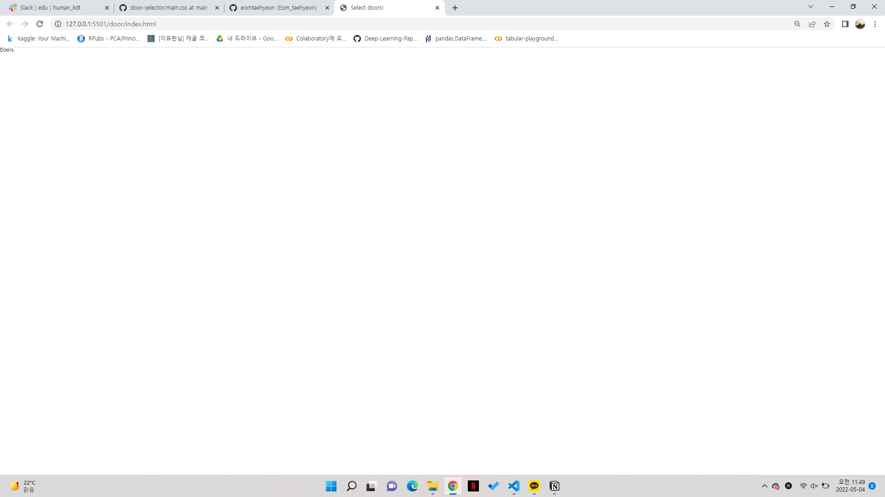
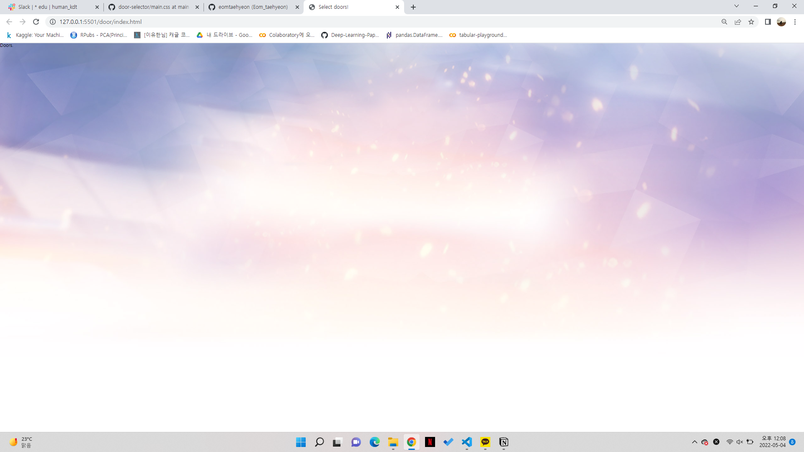
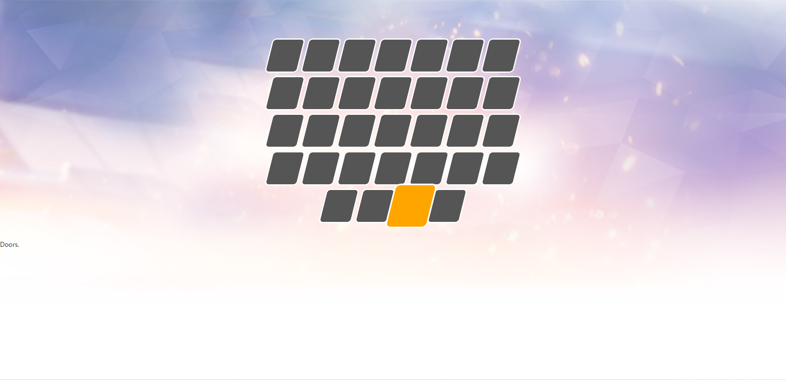
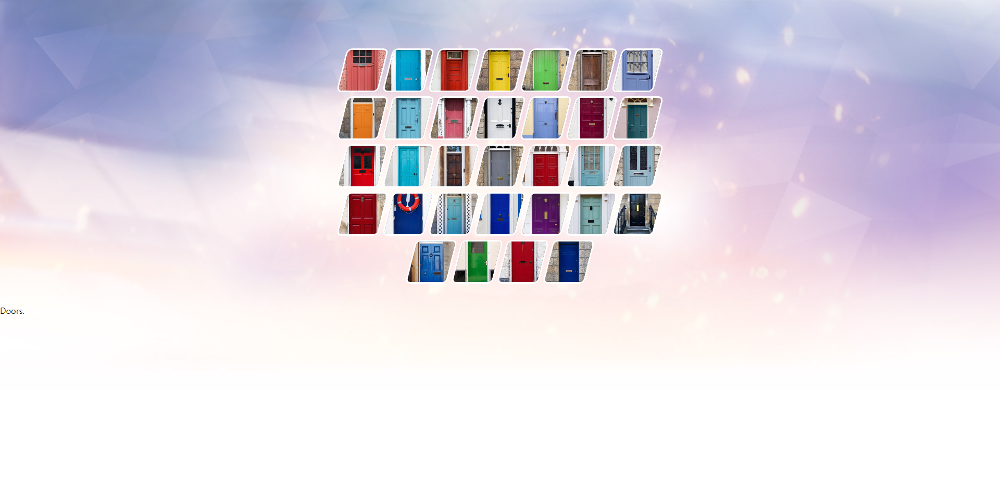

# Door_selector

[Select doors!](https://dreamy-mcnulty-986c58.netlify.app/)

- https://github.com/ParkYoungWoong/door-selector

# index.html 파일

```html
<!-- index.html 파일 헤드 부분 -->
<!DOCTYPE html>
<html lang="" ko>

<head>
    <meta charset="UTF=8"> <!-- 폰트 -->
    <meta name="viewport"
        content="width=device-width, user-scalable=no, initial-scale=1.0, maximum-scale=1.0, minimum-scale=1.0">
    <meta http-equiv="X-UA-Compatible" content="ie=edge">
    <title>Select doors!</title> <!-- 타이틀명 작성 -->

    <link rel="stylesheet" href="https://cdn.jsdelivr.net/npm/reset-css@5.0.1/reset.min.css">
    <link rel="stylesheet" href="./main.css"> <!-- main.css 파일과 연결 -->
</head>

</html>
```


```html
<!-- index.html 파일 body 부분 -->
<!-- css 파일에 클래스명으로 옵션을 넣어줘야 한다. -->

<body>
<div class="container">
  
      <!--Doors-->
      <div class="doors">
        <div class="door">
          <div class="image"></div>
        </div>
        <div class="door">
          <div class="image"></div>
        </div>
        <div class="door">
          <div class="image"></div>
        </div>
        <div class="door">
          <div class="image"></div>
        </div>
        <div class="door">
          <div class="image"></div>
        </div>
        <div class="door">
          <div class="image"></div>
        </div>
        <div class="door">
          <div class="image"></div>
        </div>
        <div class="door">
          <div class="image"></div>
        </div>
        <div class="door">
          <div class="image"></div>
        </div>
        <div class="door">
          <div class="image"></div>
        </div>
        <div class="door">
          <div class="image"></div>
        </div>
        <div class="door">
          <div class="image"></div>
        </div>
        <div class="door">
          <div class="image"></div>
        </div>
        <div class="door">
          <div class="image"></div>
        </div>
        <div class="door">
          <div class="image"></div>
        </div>
        <div class="door">
          <div class="image"></div>
        </div>
        <div class="door">
          <div class="image"></div>
        </div>
        <div class="door">
          <div class="image"></div>
        </div>
        <div class="door">
          <div class="image"></div>
        </div>
        <div class="door">
          <div class="image"></div>
        </div>
        <div class="door">
          <div class="image"></div>
        </div>
        <div class="door">
          <div class="image"></div>
        </div>
        <div class="door">
          <div class="image"></div>
        </div>
        <div class="door">
          <div class="image"></div>
        </div>
        <div class="door">
          <div class="image"></div>
        </div>
        <div class="door">
          <div class="image"></div>
        </div>
        <div class="door">
          <div class="image"></div>
        </div>
        <div class="door">
          <div class="image"></div>
        </div>
        <div class="door">
          <div class="image"></div>
        </div>
        <div class="door">
          <div class="image"></div>
        </div>
        <div class="door">
          <div class="image"></div>
        </div>
        <div class="door">
          <div class="image"></div>
        </div>
      </div>
  
      <!--Title-->
      <h1 class="title">
        Doors.
      </div>
  
    </div>
  
  </body>
  </html>
```



- css파일이 없어 body파일에 타이틀명만 적용되었다.

# main.css 파일

```css
/* 뒷 배경화면 적용 */
body {
  background-image: url("https://raw.githubusercontent.com/ParkYoungWoong/door-selector/main/images/bg.jpg");
  background-size: cover;
  background-repeat: no-repeat;
}
```



```css
/* container 라는 클래스를 50px 만큼 패딩 */
.container {
    padding: 50px 0;
  }

```


- 50px 만큼 타이틀명이 내려감.

```css
/* doors 클래스 */
.doors {
    display: flex;
    flex-wrap: wrap;
    justify-content: center;
    max-width: 660px;
    margin: 0 auto;
    padding: 40px 20px;
}
```


- 타이틀이 더 내려감.

```css
/* door 클래스 */ 
.door {
    width: 80px;
    height: 84px;
    margin: 4px;
    background-color: #555;
    border: 3px solid #fff;
    transform: skewX(-14deg); /* 틀의 모양 */
    border-radius: 10px; 
	  box-sizing: border-box;
    transition: transform .1s, background-color .6s;
    overflow: hidden;
  }
/* door 클래스가 32개가 있어 박스 32개가 적용 */
```


- 문의 커서를 가져다 대면 작용하는 옵션 설정

```css
/* door:hover 문에 커서를 가져다 대면 작용하는것 */
/*.door:hover {
    background-color: orange;
    transform: skewX(-14deg) scale(1.3);
    z-index: 1;
  }*/

```



- 문의 위치 설정

```css
/* 문과 이미지의 포지션을 잡아줌 */
.door .image {
    width: 130%;
    height: 100%;
    background-size: cover;
    transform: translateX(-11px) skewX(14deg);
    background-position: center;
}
```

- 문의 그림 삽입

```css
.door:nth-child(1) .image {
    background-image: url("https://raw.githubusercontent.com/ParkYoungWoong/door-selector/main/images/img1.jpg");
}

.door:nth-child(2) .image {
    background-image: url("https://raw.githubusercontent.com/ParkYoungWoong/door-selector/main/images/img2.jpg");
}

.door:nth-child(3) .image {
    background-image: url("https://raw.githubusercontent.com/ParkYoungWoong/door-selector/main/images/img3.jpg");
}

.door:nth-child(4) .image {
    background-image: url("https://raw.githubusercontent.com/ParkYoungWoong/door-selector/main/images/img4.jpg");
}

.door:nth-child(5) .image {
    background-image: url("https://raw.githubusercontent.com/ParkYoungWoong/door-selector/main/images/img5.jpg");
}

.door:nth-child(6) .image {
    background-image: url("https://raw.githubusercontent.com/ParkYoungWoong/door-selector/main/images/img6.jpg");
}

.door:nth-child(7) .image {
    background-image: url("https://raw.githubusercontent.com/ParkYoungWoong/door-selector/main/images/img7.jpg");
}

.door:nth-child(8) .image {
    background-image: url("https://raw.githubusercontent.com/ParkYoungWoong/door-selector/main/images/img8.jpg");
}

.door:nth-child(9) .image {
    background-image: url("https://raw.githubusercontent.com/ParkYoungWoong/door-selector/main/images/img9.jpg");
}

.door:nth-child(10) .image {
    background-image: url("https://raw.githubusercontent.com/ParkYoungWoong/door-selector/main/images/img10.jpg");
}

.door:nth-child(11) .image {
    background-image: url("https://raw.githubusercontent.com/ParkYoungWoong/door-selector/main/images/img11.jpg");
}

.door:nth-child(12) .image {
    background-image: url("https://raw.githubusercontent.com/ParkYoungWoong/door-selector/main/images/img12.jpg");
}

.door:nth-child(13) .image {
    background-image: url("https://raw.githubusercontent.com/ParkYoungWoong/door-selector/main/images/img13.jpg");
}

.door:nth-child(14) .image {
    background-image: url("https://raw.githubusercontent.com/ParkYoungWoong/door-selector/main/images/img14.jpg");
}

.door:nth-child(15) .image {
    background-image: url("https://raw.githubusercontent.com/ParkYoungWoong/door-selector/main/images/img15.jpg");
}

.door:nth-child(16) .image {
    background-image: url("https://raw.githubusercontent.com/ParkYoungWoong/door-selector/main/images/img16.jpg");
}

.door:nth-child(17) .image {
    background-image: url("https://raw.githubusercontent.com/ParkYoungWoong/door-selector/main/images/img17.jpg");
}

.door:nth-child(18) .image {
    background-image: url("https://raw.githubusercontent.com/ParkYoungWoong/door-selector/main/images/img18.jpg");
}

.door:nth-child(19) .image {
    background-image: url("https://raw.githubusercontent.com/ParkYoungWoong/door-selector/main/images/img19.jpg");
}

.door:nth-child(20) .image {
    background-image: url("https://raw.githubusercontent.com/ParkYoungWoong/door-selector/main/images/img20.jpg");
}

.door:nth-child(21) .image {
    background-image: url("https://raw.githubusercontent.com/ParkYoungWoong/door-selector/main/images/img21.jpg");
}

.door:nth-child(22) .image {
    background-image: url("https://raw.githubusercontent.com/ParkYoungWoong/door-selector/main/images/img22.jpg");
}

.door:nth-child(23) .image {
    background-image: url("https://raw.githubusercontent.com/ParkYoungWoong/door-selector/main/images/img23.jpg");
}

.door:nth-child(24) .image {
    background-image: url("https://raw.githubusercontent.com/ParkYoungWoong/door-selector/main/images/img24.jpg");
}

.door:nth-child(25) .image {
    background-image: url("https://raw.githubusercontent.com/ParkYoungWoong/door-selector/main/images/img25.jpg");
}

.door:nth-child(26) .image {
    background-image: url("https://raw.githubusercontent.com/ParkYoungWoong/door-selector/main/images/img26.jpg");
}

.door:nth-child(27) .image {
    background-image: url("https://raw.githubusercontent.com/ParkYoungWoong/door-selector/main/images/img27.jpg");
}

.door:nth-child(28) .image {
    background-image: url("https://raw.githubusercontent.com/ParkYoungWoong/door-selector/main/images/img28.jpg");
}

.door:nth-child(29) .image {
    background-image: url("https://raw.githubusercontent.com/ParkYoungWoong/door-selector/main/images/img29.jpg");
}

.door:nth-child(30) .image {
    background-image: url("https://raw.githubusercontent.com/ParkYoungWoong/door-selector/main/images/img30.jpg");
}

.door:nth-child(31) .image {
    background-image: url("https://raw.githubusercontent.com/ParkYoungWoong/door-selector/main/images/img31.jpg");
}

.door:nth-child(32) .image {
    background-image: url("https://raw.githubusercontent.com/ParkYoungWoong/door-selector/main/images/img32.jpg");
}
```



- 타이틀 설정

```css
/* h1.title 옵션 설정 
h1.title {
    font-size: 30px;
    font-weight: bold;
    color: #333;
    text-align: center;
}
```

